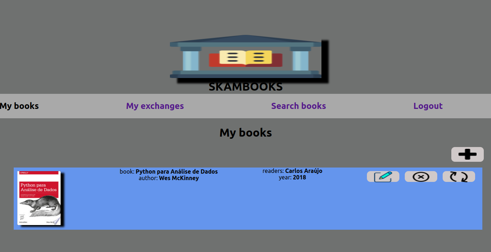
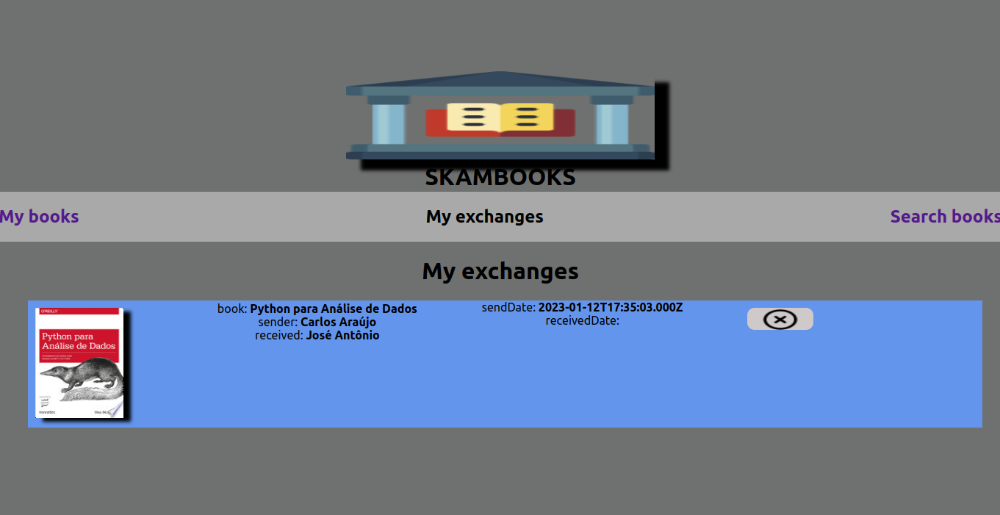
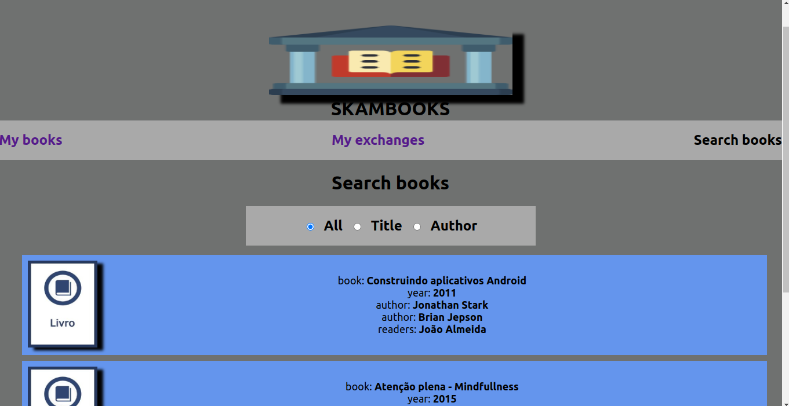

# Project Skambooks
Uma aplicação full stack para troca de livros entre leitores. Leitores se cadastram na aplicação e adicionam seus livros disponíveis para troca. A cada livro trocado, a pessoa leitora que envia o livro ganha um crédito, o que dá direito a receber outro livro. 

## Status do projeto

## Instalação/Execução 
 
Aplicação pode ser executada em https://skambooks-production.up.railway.app/

## Funcionalidades 
 
- Cadastro de leitores na plataforma, com definição de login e senha. Após o login, a pessoa usuária verá um tela como abaixo, onde pode inserir/editar/excluir livros ou enviar um livro para troca. 

- Leitor cadastra seus livros disponíveis para troca (caso seja um leitor novo, este ganha 1 crédito). Os créditos habilitam os leitores a solicitar uma troca (1 crédito = 1 livro)
- Leitor-1 envia livro para o Leitor-2. É necessário que o Leitor-2 tenha créditos
- Leitor-2 recepciona o livro, o qual passa a ser de sua propriedade
- Na tela My Exchanges, a pessoa leitora visualiza todas as suas trocas, enviadas, recebidas, podendo confirmar uma troca recebida ou excluir uma troca que tenha sido enviada
 
- Em Search Books, a pessoa usuária pode pesquisar livros, por Título, por Autor ou mesmo visualizar todos.

- A logística da troca não é gerenciada pela aplicação, ficando sob responsabilidade dos leitores
 
## Tecnologias utilizadas
 

## Pessoas desenvolvedoras

| [ Carlos Araújo](https://github.com/stonefullstm) |  [ Reinaldo Santos](https://github.com/reinaldoper) |
| :---: | :---: |
